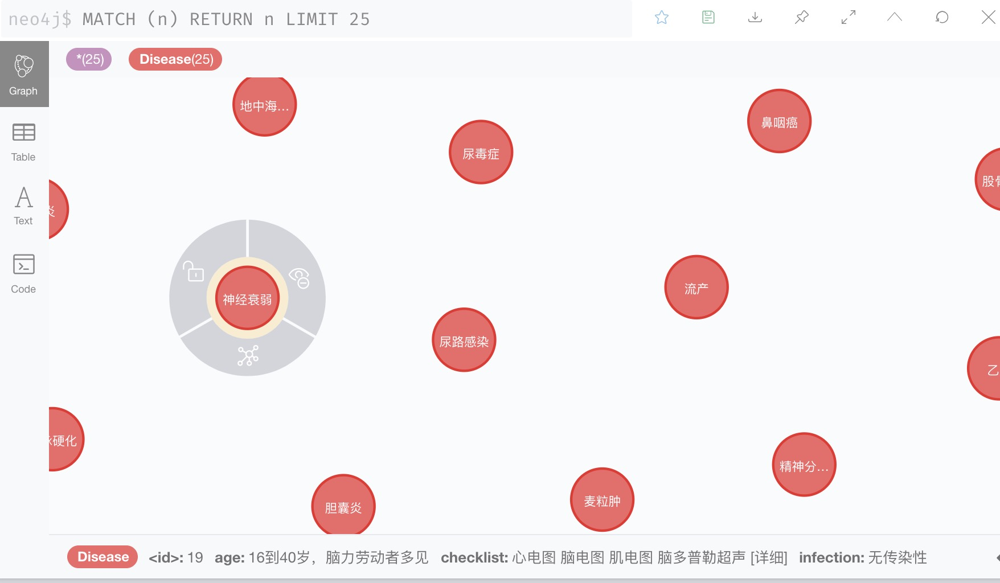
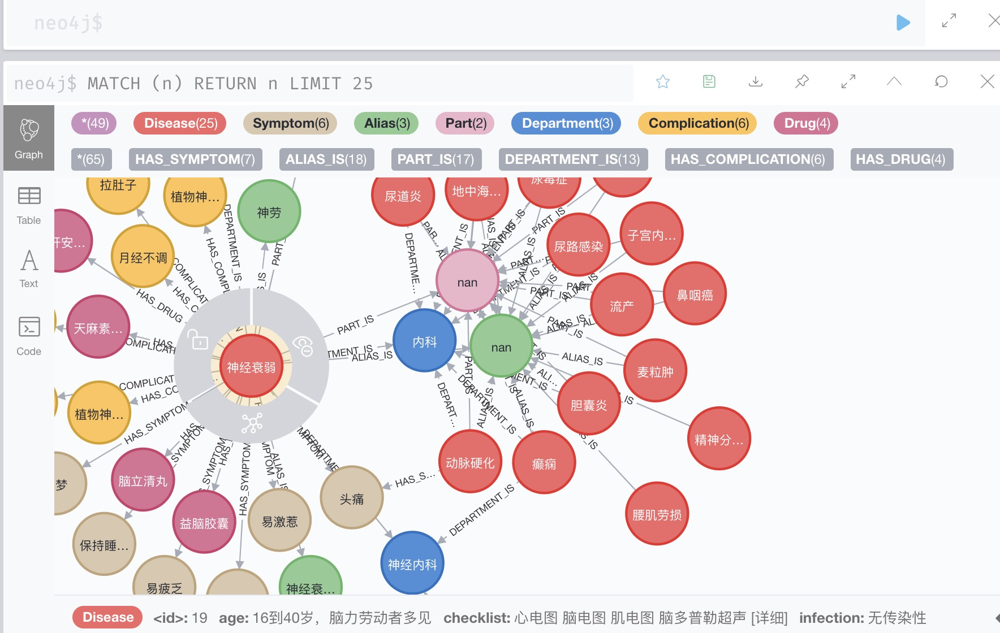
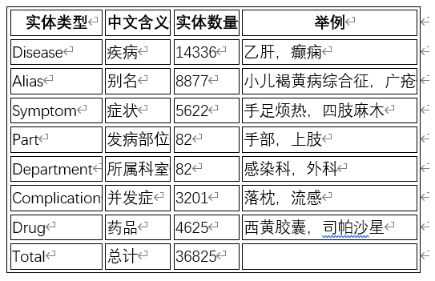
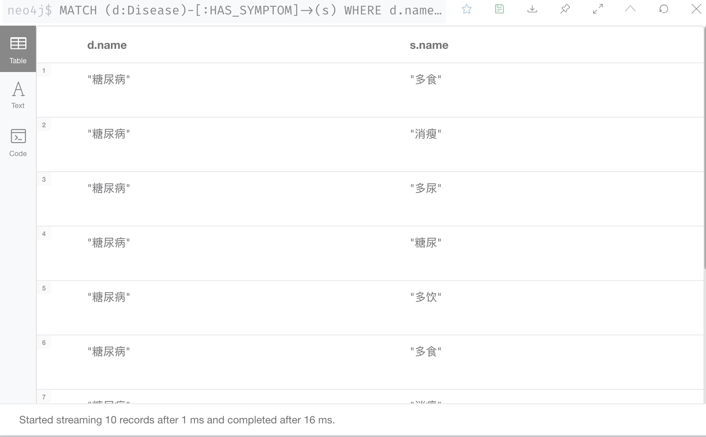
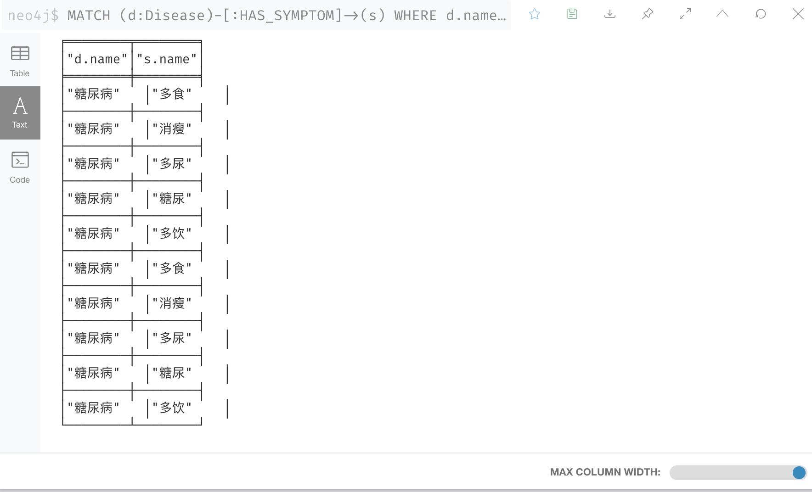
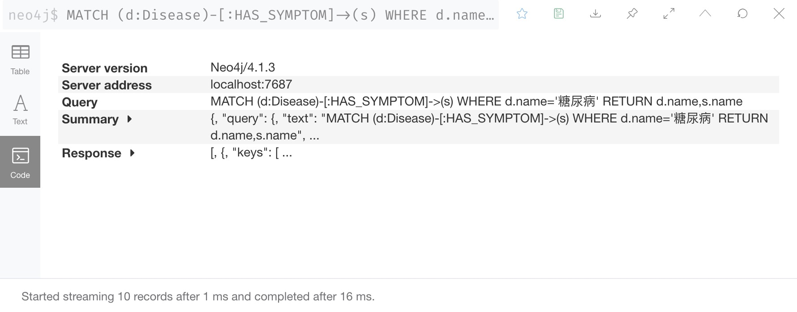

# Neo4介绍
1. Neo4j是一个世界领先的开源图形数据库，由Java编写。图形数据库也就意味着它的数据并非保存在表或集合中，而是保存为节点以及节点之间的关系。
2. Neo4j的数据由下面3部分构成：节点边和属性。
3. Neo4j除了顶点（Node）和边（Relationship），还有一种重要的部分——属性。无论是顶点还是边，都可以有任意多的属性。属性的存放类似于一个HashMap，Key为一个字符串，而Value必须是基本类型或者是基本类型数组。
在Neo4j中，节点以及边都能够包含保存值的属性，此外：可以为节点设置零或多个标签（例如Author或Book）每个关系都对应一种类型（例如WROTE或FRIEND_OF）关系总是从一个节点指向另一个节点（但可以在不考虑指向性的情况下进行查询）
# Neo4j Cypher查询
1. Neo4j的查询语言“Cypher”是一个描述性的图形查询语言，允许不必编写图形结构的遍历代码对图形存储有表现力和效率的查询。Cypher还在继续发展和成熟，这也就意味着有可能会出现语法的变化。同时也意味着作为组件没有经历严格的性能测试。
2. Cypher设计的目的是一个人类查询语言，适合于开发者和在数据库上做点对点模式（ad-hoc）查询的专业操作人员（我认为这个很重要）。它的构念是基于英语单词和灵巧的图解。
3. Cyper通过一系列不同的方法和建立于确定的实践为表达查询而激发的。许多关键字如like和order by是受SQL的启发。模式匹配的表达式来自于SPARQL。正则表达式匹配实现实用Scala programming language语言。
4. Cypher是一个申明式的语言。对比命令式语言如Java和脚本语言如Gremlin和JRuby，它的焦点在于从图中如何找回（what to retrieve），而不是怎么去做。这使得在不对用户公布的实现细节里关心的是怎么优化查询。
5. 连接neo4j数据库之后，在浏览器中使用http://localhost:7474/browser/网址查看数据库，初始账户跟密码都是neo4j
6. 首先查看图数据库  
7. 导入的数据的知识图谱
8. 我们首先查询症状：输入语句："MATCH (d:Disease)-[:HAS_SYMPTOM]->(s) WHERE d.name='糖尿病' RETURN d.name,s.name"
9. 返回可以是Table,Text,跟code
10. 
11. 
12. 
# Python中的neo4j
1. 在Python中我们使用py2neo进行查询
2. 首先安装py2neo,pip install py2neo
3. 连接上neo4j数据库
4. ```python 
    from py2neo import Graph 
    graph = Graph("http://localhost:7474", username="neo4j", password="neo4j")
5.根据不同的实体和意图构造cypher查询语句
```python
    def question_parser(data):
        """
        主要是根据不同的实体和意图构造cypher查询语句
        :param data: {"Disease":[], "Alias":[], "Symptom":[], "Complication":[]}
        :return:
        """
        sqls = []
        if data:
            for intent in data["intentions"]:
                sql_ = {}
                sql_["intention"] = intent
                sql = []
                if data.get("Disease"):
                   sql = transfor_to_sql("Disease", data["Disease"], intent)
                elif data.get("Alias"):
                    sql = transfor_to_sql("Alias", data["Alias"], intent)
                elif data.get("Symptom"):
                    sql = transfor_to_sql("Symptom", data["Symptom"], intent)
                elif data.get("Complication"):
                    sql = transfor_to_sql("Complication", data["Complication"], intent)

                if sql:
                    sql_['sql'] = sql
                    sqls.append(sql_)
        return sql
```
6.将问题转变为cypher查询语句
```python
    def transfor_to_sql(label, entities, intent):
        """
        将问题转变为cypher查询语句
        :param label:实体标签
        :param entities:实体列表
        :param intent:查询意图
        :return:cypher查询语句
        """
        if not entities:
            return []
        sql = []

        # 查询症状
        if intent == "query_symptom" and label == "Disease":
            sql = ["MATCH (d:Disease)-[:HAS_SYMPTOM]->(s) WHERE d.name='{0}' RETURN d.name,s.name".format(e)
                   for e in entities]
        # 查询治疗方法
        if intent == "query_cureway" and label == "Disease":
            sql = ["MATCH (d:Disease)-[:HAS_DRUG]->(n) WHERE d.name='{0}' return d.name,d.treatment," \
                   "n.name".format(e) for e in entities]
         # 查询治疗周期
        if intent == "query_period" and label == "Disease":
            sql = ["MATCH (d:Disease) WHERE d.name='{0}' return d.name,d.period".format(e) for e in entities
        ...
```
7.执行cypher查询，返回结果
```python
    def searching(sqls):
        """
        执行cypher查询，返回结果
        :param sqls:
        :return:str
        """
        final_answers = []
        for sql_ in sqls:
            intent = sql_['intention']
            queries = sql_['sql']
            answers = []
            for query in queries:
                ress = graph.run(query).data()
                answers += ress
            final_answer = answer_template(intent, answers)
            if final_answer:
                final_answers.append(final_answer)
        return final_answers
```
8.根据不同意图，返回不同模板的答案
```python
    def answer_template(intent, answers):
        """
        根据不同意图，返回不同模板的答案
        :param intent: 查询意图
        :param answers: 知识图谱查询结果
        :return: str
        """
        final_answer = ""
        if not answers:
            return ""
        # 查询症状
        if intent == "query_symptom":
            disease_dic = {}
            for data in answers:
                d = data['d.name']
                s = data['s.name']
                if d not in disease_dic:
                    disease_dic[d] = [s]
                else:
                    disease_dic[d].append(s)
            i = 0
            for k, v in disease_dic.items():
                if i >= 10:
                    break
                final_answer += "疾病 {0} 的症状有：{1}\n".format(k, ','.join(list(set(v))))
                i += 1
            ...
```
9.完整代码
```python
#!/usr/bin/env python3
# coding: utf-8
from py2neo import Graph


class AnswerSearching:
    def __init__(self):
        self.graph = Graph("http://localhost:7474", username="neo4j", password="123456789")
        self.top_num = 10

    def question_parser(self, data):
        """
        主要是根据不同的实体和意图构造cypher查询语句
        :param data: {"Disease":[], "Alias":[], "Symptom":[], "Complication":[]}
        :return:
        """
        sqls = []
        if data:
            for intent in data["intentions"]:
                sql_ = {}
                sql_["intention"] = intent
                sql = []
                if data.get("Disease"):
                   sql = self.transfor_to_sql("Disease", data["Disease"], intent)
                elif data.get("Alias"):
                    sql = self.transfor_to_sql("Alias", data["Alias"], intent)
                elif data.get("Symptom"):
                    sql = self.transfor_to_sql("Symptom", data["Symptom"], intent)
                elif data.get("Complication"):
                    sql = self.transfor_to_sql("Complication", data["Complication"], intent)

                if sql:
                    sql_['sql'] = sql
                    sqls.append(sql_)
        return sqls

    def transfor_to_sql(self, label, entities, intent):
        """
        将问题转变为cypher查询语句
        :param label:实体标签
        :param entities:实体列表
        :param intent:查询意图
        :return:cypher查询语句
        """
        if not entities:
            return []
        sql = []

        # 查询症状
        if intent == "query_symptom" and label == "Disease":
            sql = ["MATCH (d:Disease)-[:HAS_SYMPTOM]->(s) WHERE d.name='{0}' RETURN d.name,s.name".format(e)
                   for e in entities]
        if intent == "query_symptom" and label == "Alias":
            sql = ["MATCH (a:Alias)<-[:ALIAS_IS]-(d:Disease)-[:HAS_SYMPTOM]->(s) WHERE a.name='{0}' return " \
                   "d.name,s.name".format(e) for e in entities]

        # 查询治疗方法
        if intent == "query_cureway" and label == "Disease":
            sql = ["MATCH (d:Disease)-[:HAS_DRUG]->(n) WHERE d.name='{0}' return d.name,d.treatment," \
                   "n.name".format(e) for e in entities]
        if intent == "query_cureway" and label == "Alias":
            sql = ["MATCH (n)<-[:HAS_DRUG]-(d:Disease)-[]->(a:Alias) WHERE a.name='{0}' " \
                   "return d.name, d.treatment, n.name".format(e) for e in entities]
        if intent == "query_cureway" and label == "Symptom":
            sql = ["MATCH (n)<-[:HAS_DRUG]-(d:Disease)-[]->(s:Symptom) WHERE s.name='{0}' " \
                   "return d.name,d.treatment, n.name".format(e) for e in entities]
        if intent == "query_cureway" and label == "Complication":
            sql = ["MATCH (n)<-[:HAS_DRUG]-(d:Disease)-[]->(c:Complication) WHERE c.name='{0}' " \
                   "return d.name,d.treatment, n.name".format(e) for e in entities]

        # 查询治疗周期
        if intent == "query_period" and label == "Disease":
            sql = ["MATCH (d:Disease) WHERE d.name='{0}' return d.name,d.period".format(e) for e in entities]
        if intent == "query_period" and label == "Alias":
            sql = ["MATCH (d:Disease)-[]->(a:Alias) WHERE a.name='{0}' return d.name,d.period".format(e)
                   for e in entities]
        if intent == "query_period" and label == "Symptom":
            sql = ["MATCH (d:Disease)-[]->(s:Symptom) WHERE s.name='{0}' return d.name,d.period".format(e)
                   for e in entities]
        if intent == "query_period" and label == "Complication":
            sql = ["MATCH (d:Disease)-[]->(c:Complication) WHERE c.name='{0}' return d.name," \
                   "d.period".format(e) for e in entities]

        # 查询治愈率
        if intent == "query_rate" and label == "Disease":
            sql = ["MATCH (d:Disease) WHERE d.name='{0}' return d.name,d.rate".format(e) for e in entities]
        if intent == "query_rate" and label == "Alias":
            sql = ["MATCH (d:Disease)-[]->(a:Alias) WHERE a.name='{0}' return d.name,d.rate".format(e)
                   for e in entities]
        if intent == "query_rate" and label == "Symptom":
            sql = ["MATCH (d:Disease)-[]->(s:Symptom) WHERE s.name='{0}' return d.name,d.rate".format(e)
                   for e in entities]
        if intent == "query_rate" and label == "Complication":
            sql = ["MATCH (d:Disease)-[]->(c:Complication) WHERE c.name='{0}' return d.name," \
                   "d.rate".format(e) for e in entities]

        # 查询检查项目
        if intent == "query_checklist" and label == "Disease":
            sql = ["MATCH (d:Disease) WHERE d.name='{0}' return d.name,d.checklist".format(e) for e in entities]
        if intent == "query_checklist" and label == "Alias":
            sql = ["MATCH (d:Disease)-[]->(a:Alias) WHERE a.name='{0}' return d.name,d.checklist".format(e)
                   for e in entities]
        if intent == "query_checklist" and label == "Symptom":
            sql = ["MATCH (d:Disease)-[]->(s:Symptom) WHERE s.name='{0}' return d.name," \
                   "d.checklist".format(e) for e in entities]
        if intent == "query_checklist" and label == "Complication":
            sql = ["MATCH (d:Disease)-[]->(c:Complication) WHERE c.name='{0}' return d.name," \
                   "d.checklist".format(e) for e in entities]

        # 查询科室
        if intent == "query_department" and label == "Disease":
            sql = ["MATCH (d:Disease)-[:DEPARTMENT_IS]->(n) WHERE d.name='{0}' return d.name," \
                   "n.name".format(e) for e in entities]
        if intent == "query_department" and label == "Alias":
            sql = ["MATCH (n)<-[:DEPARTMENT_IS]-(d:Disease)-[:ALIAS_IS]->(a:Alias) WHERE a.name='{0}' " \
                   "return d.name,n.name".format(e) for e in entities]
        if intent == "query_department" and label == "Symptom":
            sql = ["MATCH (n)<-[:DEPARTMENT_IS]-(d:Disease)-[:HAS_SYMPTOM]->(s:Symptom) WHERE s.name='{0}' " \
                   "return d.name,n.name".format(e) for e in entities]
        if intent == "query_department" and label == "Complication":
            sql = ["MATCH (n)<-[:DEPARTMENT_IS]-(d:Disease)-[:HAS_COMPLICATION]->(c:Complication) WHERE " \
                   "c.name='{0}' return d.name,n.name".format(e) for e in entities]

        # 查询疾病
        if intent == "query_disease" and label == "Alias":
            sql = ["MATCH (d:Disease)-[]->(s:Alias) WHERE s.name='{0}' return " \
                   "d.name".format(e) for e in entities]
        if intent == "query_disease" and label == "Symptom":
            sql = ["MATCH (d:Disease)-[]->(s:Symptom) WHERE s.name='{0}' return " \
                   "d.name".format(e) for e in entities]

        # 查询疾病描述
        if intent == "disease_describe" and label == "Alias":
            sql = ["MATCH (d:Disease)-[]->(a:Alias) WHERE a.name='{0}' return d.name,d.age," \
                   "d.insurance,d.infection,d.checklist,d.period,d.rate,d.money".format(e) for e in entities]
        if intent == "disease_describe" and label == "Disease":
            sql = ["MATCH (d:Disease) WHERE d.name='{0}' return d.name,d.age,d.insurance,d.infection," \
                   "d.checklist,d.period,d.rate,d.money".format(e) for e in entities]
        if intent == "disease_describe" and label == "Symptom":
            sql = ["MATCH (d:Disease)-[]->(s:Symptom) WHERE s.name='{0}' return d.name,d.age," \
                   "d.insurance,d.infection,d.checklist,d.period,d.rate,d.money".format(e) for e in entities]
        if intent == "disease_describe" and label == "Complication":
            sql = ["MATCH (d:Disease)-[]->(c:Complication) WHERE c.name='{0}' return d.name," \
                   "d.age,d.insurance,d.infection,d.checklist,d.period,d.rate,d.money".format(e) for e in entities]

        return sql

    def searching(self, sqls):
        """
        执行cypher查询，返回结果
        :param sqls:
        :return:str
        """
        final_answers = []
        for sql_ in sqls:
            intent = sql_['intention']
            queries = sql_['sql']
            answers = []
            for query in queries:
                ress = self.graph.run(query).data()
                answers += ress
            final_answer = self.answer_template(intent, answers)
            if final_answer:
                final_answers.append(final_answer)
        return final_answers

    def answer_template(self, intent, answers):
        """
        根据不同意图，返回不同模板的答案
        :param intent: 查询意图
        :param answers: 知识图谱查询结果
        :return: str
        """
        final_answer = ""
        if not answers:
            return ""
        # 查询症状
        if intent == "query_symptom":
            disease_dic = {}
            for data in answers:
                d = data['d.name']
                s = data['s.name']
                if d not in disease_dic:
                    disease_dic[d] = [s]
                else:
                    disease_dic[d].append(s)
            i = 0
            for k, v in disease_dic.items():
                if i >= 10:
                    break
                final_answer += "疾病 {0} 的症状有：{1}\n".format(k, ','.join(list(set(v))))
                i += 1
        # 查询疾病
        if intent == "query_disease":
            disease_freq = {}
            for data in answers:
                d = data["d.name"]
                disease_freq[d] = disease_freq.get(d, 0) + 1
            n = len(disease_freq.keys())
            freq = sorted(disease_freq.items(), key=lambda x: x[1], reverse=True)
            for d, v in freq[:10]:
                final_answer += "疾病为 {0} 的概率为：{1}\n".format(d, v/10)
        # 查询治疗方法
        if intent == "query_cureway":
            disease_dic = {}
            for data in answers:
                disease = data['d.name']
                treat = data["d.treatment"]
                drug = data["n.name"]
                if disease not in disease_dic:
                    disease_dic[disease] = [treat, drug]
                else:
                    disease_dic[disease].append(drug)
            i = 0
            for d, v in disease_dic.items():
                if i >= 10:
                    break
                final_answer += "疾病 {0} 的治疗方法有：{1}；可用药品包括：{2}\n".format(d, v[0], ','.join(v[1:]))
                i += 1
        # 查询治愈周期
        if intent == "query_period":
            disease_dic = {}
            for data in answers:
                d = data['d.name']
                p = data['d.period']
                if d not in disease_dic:
                    disease_dic[d] = [p]
                else:
                    disease_dic[d].append(p)
            i = 0
            for k, v in disease_dic.items():
                if i >= 10:
                    break
                final_answer += "疾病 {0} 的治愈周期为：{1}\n".format(k, ','.join(list(set(v))))
                i += 1
        # 查询治愈率
        if intent == "query_rate":
            disease_dic = {}
            for data in answers:
                d = data['d.name']
                r = data['d.rate']
                if d not in disease_dic:
                    disease_dic[d] = [r]
                else:
                    disease_dic[d].append(r)
            i = 0
            for k, v in disease_dic.items():
                if i >= 10:
                    break
                final_answer += "疾病 {0} 的治愈率为：{1}\n".format(k, ','.join(list(set(v))))
                i += 1
        # 查询检查项目
        if intent == "query_checklist":
            disease_dic = {}
            for data in answers:
                d = data['d.name']
                r = data['d.checklist']
                if d not in disease_dic:
                    disease_dic[d] = [r]
                else:
                    disease_dic[d].append(r)
            i = 0
            for k, v in disease_dic.items():
                if i >= 10:
                    break
                final_answer += "疾病 {0} 的检查项目有：{1}\n".format(k, ','.join(list(set(v))))
                i += 1
        # 查询科室
        if intent == "query_department":
            disease_dic = {}
            for data in answers:
                d = data['d.name']
                r = data['n.name']
                if d not in disease_dic:
                    disease_dic[d] = [r]
                else:
                    disease_dic[d].append(r)
            i = 0
            for k, v in disease_dic.items():
                if i >= 10:
                    break
                final_answer += "疾病 {0} 所属科室有：{1}\n".format(k, ','.join(list(set(v))))
                i += 1
        # 查询疾病描述
        if intent == "disease_describe":
            disease_infos = {}
            for data in answers:
                name = data['d.name']
                age = data['d.age']
                insurance = data['d.insurance']
                infection = data['d.infection']
                checklist = data['d.checklist']
                period = data['d.period']
                rate = data['d.rate']
                money = data['d.money']
                if name not in disease_infos:
                    disease_infos[name] = [age, insurance, infection, checklist, period, rate, money]
                else:
                    disease_infos[name].extend([age, insurance, infection, checklist, period, rate, money])
            i = 0
            for k, v in disease_infos.items():
                if i >= 10:
                    break
                message = "疾病 {0} 的描述信息如下：\n发病人群：{1}\n医保：{2}\n传染性：{3}\n检查项目：{4}\n" \
                          "治愈周期：{5}\n治愈率：{6}\n费用：{7}\n"
                final_answer += message.format(k, v[0], v[1], v[2], v[3], v[4], v[5], v[6])
                i += 1

        return final_answer
```